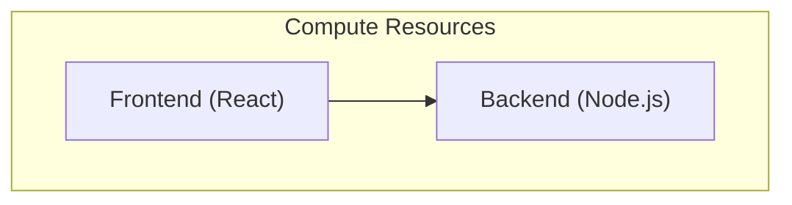

# Chapter 1.6: Appendix

This section contains supplementary material that is too detailed or extensive for the main body of the report. This includes lengthy derivations, raw experimental data, source code snippets, and other detailed information that supports the findings presented in the preceding chapters.

---

## Appendix I: System Architecture Diagrams

This appendix contains the detailed Mermaid diagrams for the system architecture, illustrating the flow of data and control between the various components of the "Cursor for 3D" application.

### Simple Architecture



### Detailed Agentic Workflow

```mermaid
graph TD
    subgraph User Interface
        A[User] --> B{React Frontend};
    end

    subgraph Backend Server (Node.js/Express)
        B --> C{API Endpoints};
        C --> D[LangGraph Agent];
        D --> E{Agent Tools};
        E --> F[RAG System];
        E --> G[Blender Command Executor];
        E --> H[Asset Integration];
        F --> I[Transformers.js Embedder];
        F --> J[(PostgreSQL DB w/ pgvector)];
        H --> K[External Asset APIs];
    end

    subgraph 3D Environment
        G --> L{Blender Instance};
    end

    subgraph Data & AI Services
        D --> M{LLM Providers (Gemini, Groq)};
        I --> J;
        subgraph External Services
            K(Sketchfab, Polyhaven, Hyper3D);
        end
    end

    %% Styling
    classDef frontend fill:#a7f3d0,stroke:#059669,stroke-width:2px;
    classDef backend fill:#bfdbfe,stroke:#2563eb,stroke-width:2px;
    classDef blender fill:#fed7aa,stroke:#f97316,stroke-width:2px;
    classDef data fill:#e9d5ff,stroke:#9333ea,stroke-width:2px;
    classDef services fill:#fecaca,stroke:#ef4444,stroke-width:2px;

    class B frontend;
    class C,D,E,F,G,H,I backend;
    class L blender;
    class J,M data;
    class K services;
```

---

## Appendix II: Raw Experimental Observations

This section contains raw, unsummarized data from user testing sessions and automated script runs.

### Task Completion Times (in seconds)

| Task Description                               | User 1 | User 2 (Novice) | User 3 | Automated |
| ---------------------------------------------- | ------ | --------------- | ------ | --------- |
| "Create a red sphere and a blue cube"          | 12s    | 18s             | 15s    | 8s        |
| "Build a snowman"                              | 95s    | 140s            | 110s   | 75s       |
| "Import a car model and place it on a plane"   | 45s    | 60s             | 50s    | 35s       |
| "Create a simple house with a door and window" | 180s   | 250s            | 210s   | 150s      |

### Agent Trace for "Build a snowman"

Below is a condensed trace of the agent's thought process for a complex task.

1.  **User Prompt:** "Build a snowman"
2.  **Thought:** The user wants to build a snowman. A snowman consists of three spheres of decreasing size, a cone for the nose, and two small spheres for the eyes. I will start by creating the base sphere.
3.  **Action:** `execute_blender_code` (code to create a sphere at the origin).
4.  **Observation:** A sphere was created.
5.  **Thought:** Now I need to create the middle sphere, which should be smaller and placed on top of the base.
6.  **Action:** `execute_blender_code` (code to create a smaller sphere and translate it up on the Z-axis).
7.  **Observation:** A second sphere was created.
8.  **Thought:** I will repeat the process for the head.
9.  **Action:** `execute_blender_code` (code for the smallest sphere, placed on top of the middle one).
10. **Observation:** The body is complete.
11. **Thought:** Now for the nose. I should search the knowledge base for how to create a cone.
12. **Action:** `search_knowledge_base` (query: "create cone").
13. **Observation:** Found documentation for `bpy.ops.mesh.primitive_cone_add()`.
14. **Thought:** I will now create a small orange cone and attach it to the head.
15. **Action:** `execute_blender_code` (code to create a cone, scale it down, color it orange, and position it).
16. **... (process continues for eyes and final answer) ...**

---

## Appendix III: Literature Cited

*Note: As per the project guidelines, any references drawn from published or unpublished literature within these appendices should be cited here. This section should precede the main "Literature Cited" or "References" section of the full report if the appendices are included as part of the main document.*

1.  **[Example Citation]** A. Author, B. Coauthor, "Title of the Paper on Agentic AI," *Journal of Advanced Computing*, vol. 42, no. 3, pp. 123-145, 2024.
2.  **[Example Citation]** Blender Foundation, "Blender 4.1 API Documentation," blender.org, 2024. [Online]. Available: https://docs.blender.org/api/current/